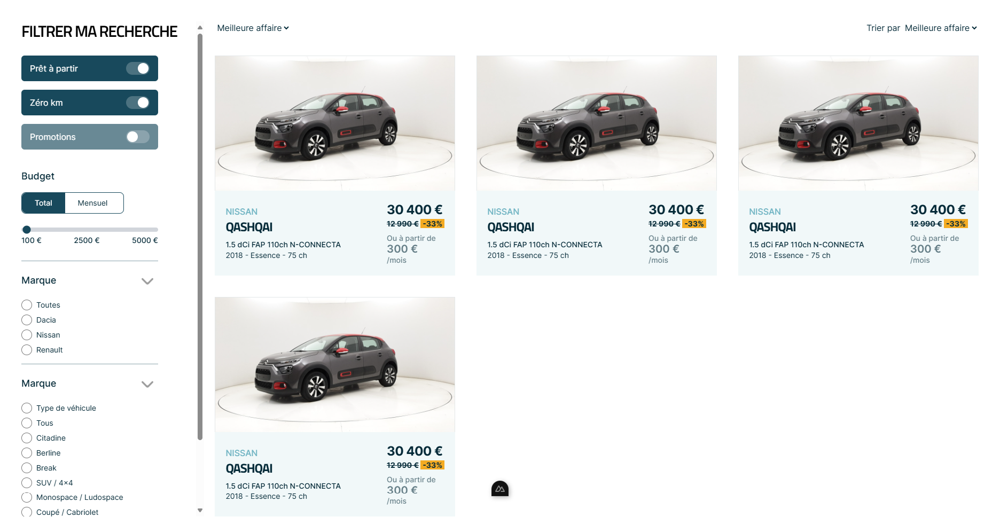

# 4 Tech Interview Project

## Project Overview

This project is a technical interview submission for 4 Tech. It involves implementing a user interface design provided via Adobe XD using Nuxt.js 3.

The design can be found here: [4 Tech UI Design](https://xd.adobe.com/view/b65f84ac-efe6-4c0c-9593-cc996d93ea5b-e30c/)

## Screenshot



## Technologies Used

- Nuxt.js 3
- Vue.js
- Tailwind CSS

## Prerequisites

Before you begin, ensure you have the following installed:
- Node.js (version 14.0.0 or higher)
- npm (version 6.0.0 or higher)

## Getting Started

1. Clone the repository:

```bash
git clone URL
cd 4tech-technical-interview
npm install
npm run dev
```

